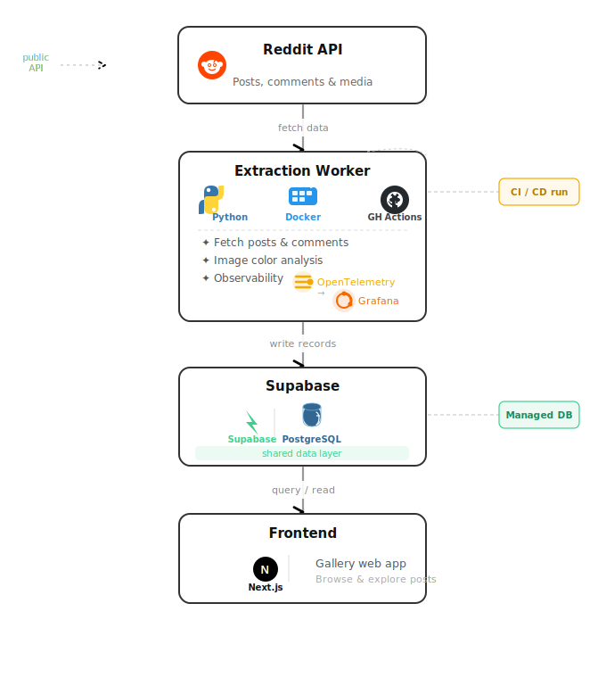
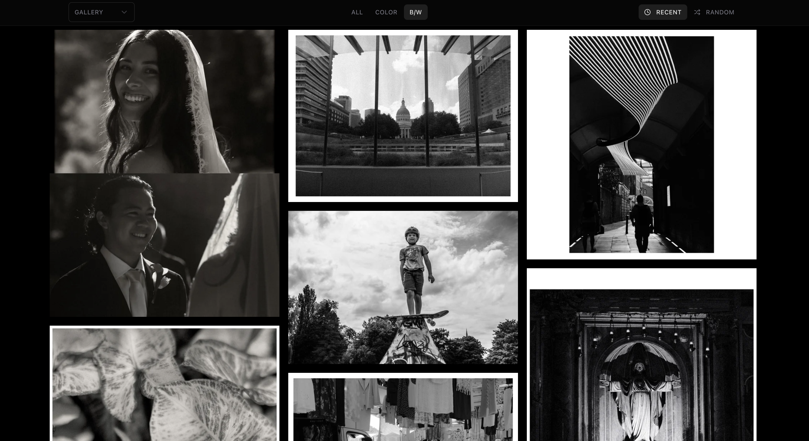

# Reddit Content Pipeline

A personal end-to-end data pipeline that scrapes photography posts from Reddit, enriches them with image color analysis, and exposes them through a gallery web app.

---

## Architecture Overview

---

## Extraction Worker

The core of the pipeline. Fetches posts from one or more subreddits, analyzes each image for color properties, and persists everything to the database.

### Deployment

Packaged as a **Docker image** and executed as a one-shot job inside a **GitHub Actions** pipeline in a separate repository. Secrets are injected as environment variables at runtime. There is no always-on server.

### Data Collection

- Scraping targets (subreddits, post limits, sort order, flair filters) are managed from the database — no code changes needed to update what gets scraped
- Communicates with Reddit via authenticated browser session cookies, replicating how a logged-in browser makes requests
- Supports pagination to fetch beyond Reddit's 100-post-per-request limit
- Rate limiting and automatic retries with exponential backoff on HTTP errors
- Handles crosspost/repost detection, extracting data from the original post

### Image Processing

For each post, images are extracted in three resolution variants (small, medium, full) and run through a computer vision pipeline entirely **in memory** (no disk I/O):

- Resize and denoise with Gaussian blur
- **Dominant color** — K-Means clustering (8 clusters) weighted by saturation, so vivid colors rank above neutral backgrounds
- **Color palette** — top 4 clusters by pixel coverage
- **B&W detection** — via LAB color space channel analysis
- **Border detection** — solid white or black borders identified by per-side margin analysis
- Output stored as HEX, HSV, and boolean flags per image

### Comment Thread Extraction

For each post, the full comment tree is fetched. If the first request returns fewer comments than expected, additional requests are made with alternative sort orders and the results are merged and deduplicated. Threads where the original poster (OP) participated are extracted and serialized as structured dialogues, stored in a processing queue for the next pipeline stage.

### Error Handling

Failed posts and images are logged to a Dead Letter Queue with full context (error type, pipeline stage, stack trace) for future reprocessing. The queue writer never crashes the main pipeline.

### Observability

The worker is fully instrumented with **OpenTelemetry**, exporting traces and metrics to **Grafana** via an OTLP collector.

**What is monitored per pipeline run:**

- Posts fetched, processed, skipped, and failed — broken down per subreddit
- Images analyzed, succeeded, and failed
- Processing time per image (with alerts on slow or large files)
- Database write count and latency
- Compute cost estimate (GiB·seconds, modeled after Lambda pricing)
- CPU time and memory (RSS) per pipeline phase
- Warning aggregation by error type

Graceful shutdown on `SIGTERM` / `SIGINT` ensures the final telemetry flush completes before the container exits.

Pipeline logs are anonymized in CI: subreddit names, post titles, and infrastructure names are masked so GitHub Actions logs can be public.

### Grafana Dashboard

[View the Grafana snapshot](https://iampedrovieira.grafana.net/dashboard/snapshot/p7DPgUryJARvVfZSOHNyMGTutE1Vmnh7)

This snapshot shows the current pipeline telemetry and observability view.

### Tech Stack

| Layer | Technology |
|---|---|
| Language | Python 3.11 |
| HTTP & retries | requests, urllib3 |
| Image processing | OpenCV, Pillow, NumPy |
| Color clustering | scikit-learn (MiniBatchKMeans) |
| Database | Supabase (PostgreSQL) |
| Observability | OpenTelemetry, Grafana |
| Containerization | Docker |
| CI/CD | GitHub Actions |

---

## Frontend

A **Next.js 16** gallery web app that reads from Supabase and displays posts in a responsive masonry photo grid.

**Features:** filter by subreddit, flair, and color · lightbox image viewer · per-post detail pages · user profile pages · Docker Compose for local development.

**Tech stack:** Next.js 16, React 19, TypeScript, Tailwind CSS v4, Radix UI, Framer Motion, shadcn/ui.

### Live Demo

[reddit-gallery-fuji.vercel.app](https://reddit-gallery-fuji.vercel.app/)

### Screenshots

<table>
	<tr>
		<td></td>
		<td></td>
	</tr>
	<tr>
		<td align="center">Gallery view with color filters</td>
		<td align="center">Black and white filtered view</td>
	</tr>
</table>

